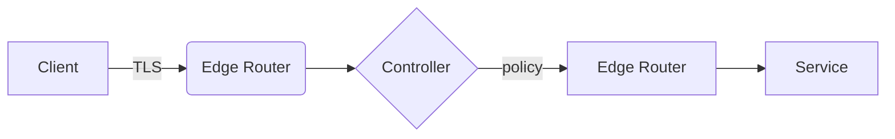
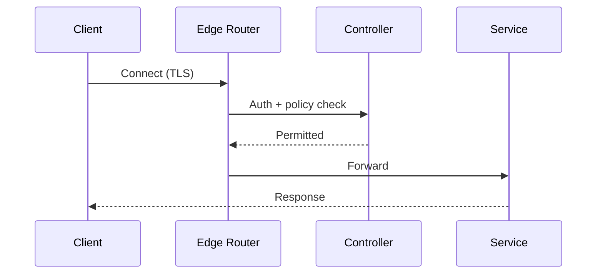
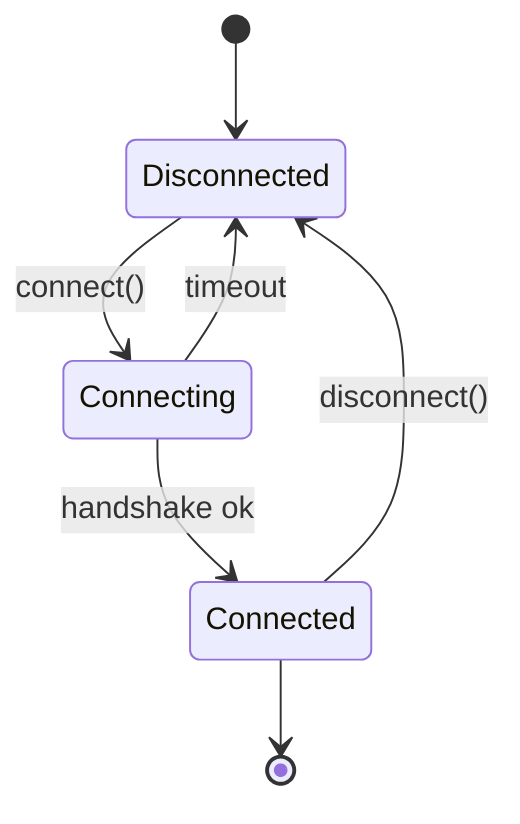
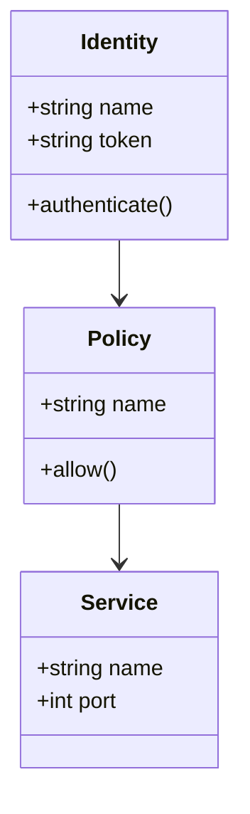
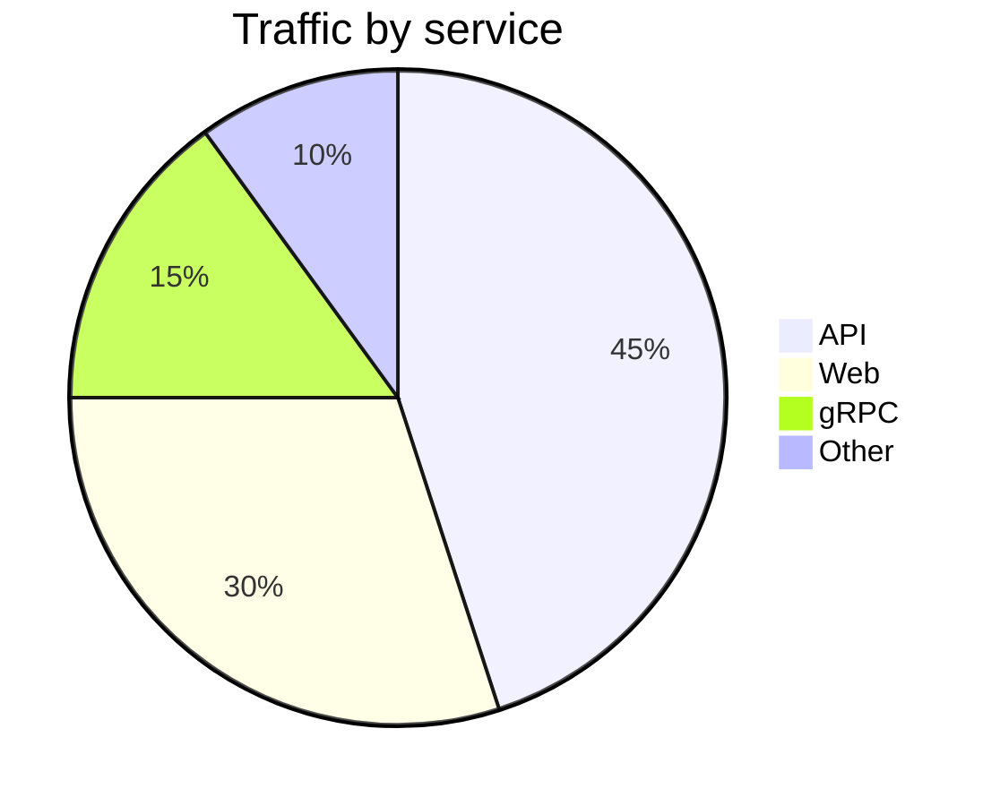

# Mermaid diagrams

`@docusaurus/theme-mermaid` is registered in `docusaurus.config.ts`, so
fenced ` ```mermaid ` blocks render as live diagrams.

## Flowchart



## Sequence diagram



## State diagram



## Class diagram



## Pie chart


