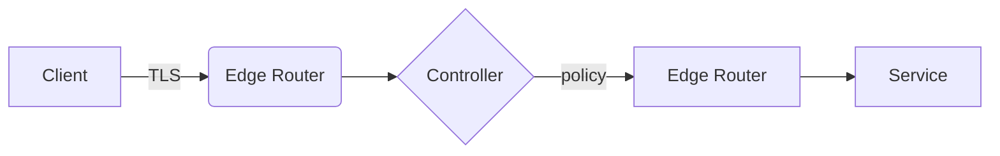
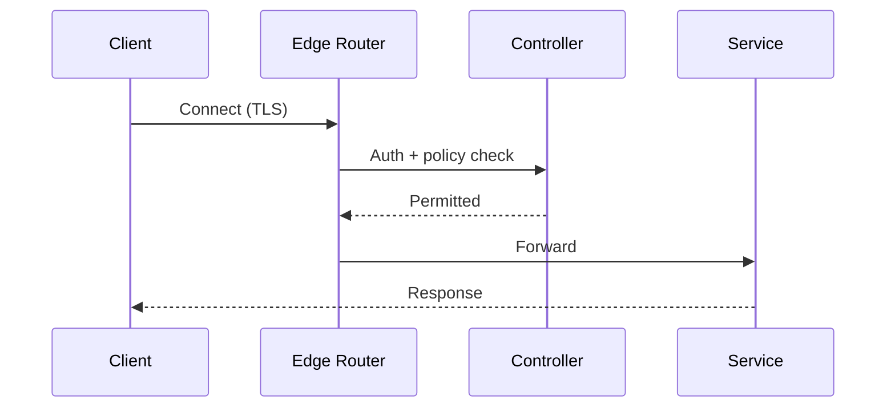
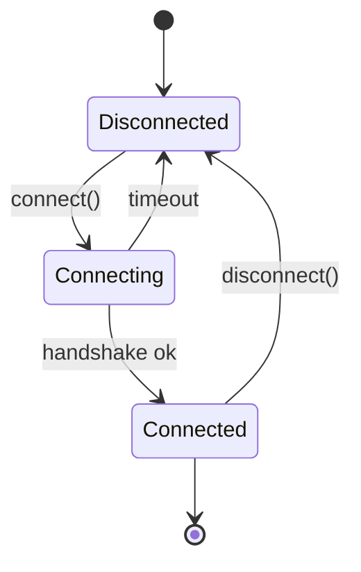
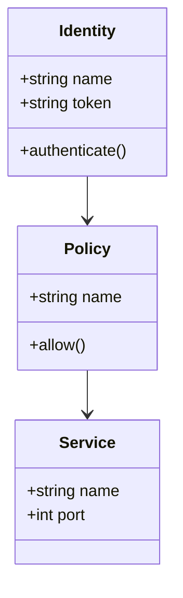
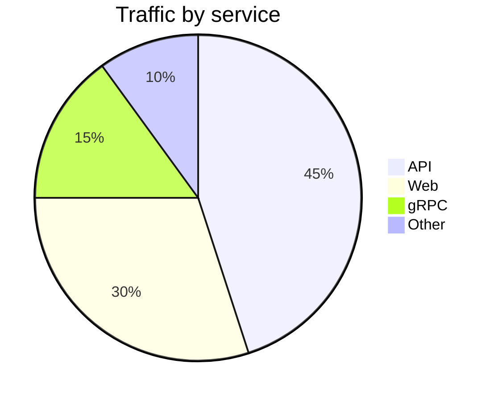

# Mermaid diagrams

`@docusaurus/theme-mermaid` is registered in `docusaurus.config.ts` and
`markdown.mermaid` is set to `true`, so fenced ` ```mermaid ` blocks render as
live diagrams. The source for each diagram is in a collapsible block underneath.

## Flowchart



<Details>
<summary>View source</summary>

````text

````

</Details>

## Sequence diagram



<Details>
<summary>View source</summary>

````text

````

</Details>

## State diagram



<Details>
<summary>View source</summary>

````text

````

</Details>

## Class diagram



<Details>
<summary>View source</summary>

````text

````

</Details>

## Pie chart



<Details>
<summary>View source</summary>

````text

````

</Details>
